# StopGateArtifact — Specification v0.1

**Status:** design draft
**Layer:** AgentPlane (execution) — emitted by the harness, consumed by policy-fabric / orchestrator
**Kind:** tamper-evident attestation object; a specialization of `ReceiptIR` that binds a gate verdict to the
evidence and the invocation window that produced it.

> Reference implementation: [`tools/stopgate_artifact.py`](../tools/stopgate_artifact.py).
> Canonical schema: [`schemas/StopGateArtifact.schema.v0.1.json`](../schemas/StopGateArtifact.schema.v0.1.json).
> This is the *formal, signed, evidence-bound* StopGateArtifact. It is distinct from the legacy check-based
> `schemas/stop-gate-artifact.schema.v0.1.json` (agent-completion gate) emitted by
> [`tools/evaluate_stop_gate.py`](../tools/evaluate_stop_gate.py); the two share a name at different maturity
> levels and coexist.

---

## 1. Purpose

A **StopGateArtifact** is a signed attestation, emitted by deterministic harness code rather than by a model,
that a named gate condition was evaluated against ground-truth evidence, such that a side-effecting action may be
permitted or denied by **verifying the artifact** instead of trusting a model's narration.

It exists to close one specific gap: in an agentic system the human's entire epistemic access to what the machine
did is mediated by the machine's own narration. The transcript's causal chain (`parentUuid`) proves a narration
*followed* a tool result; it does not prove the narration *faithfully represents* it. The StopGateArtifact removes
the narrator from the critical path for side-effecting actions — the model may propose, but the verdict that lifts
a gate is computed by the harness over hashed evidence.

**One-line invariant:** No side effect fires on a model's say-so. It fires on a signed, evidence-bound artifact, or
on an explicitly attributed human override — never silently.

---

## 2. Position in the IR kernel

| IR | Role relative to StopGateArtifact |
| --- | --- |
| `ClaimIR` | what the narration asserts ("build succeeded", "pushed v0.4.1") |
| `EvidenceIR` | the payload / invocation record the claim is checked against |
| `VerifierIR` | the verdict function producing `OK` / `VIOLATION` / `REVIEW` |
| `StopGateArtifact` | binds a `VerifierIR` verdict to `EvidenceIR` hashes + a temporal window, signs it, and licenses (or denies) a gated action |
| `ObligationIR` | duties created by consuming a `PASS` (e.g. post-hoc re-verification) |
| `ReceiptIR` | the ledger entry recording that the artifact was consumed |
| `LedgerIR` | append-only store; note it is **not** itself trusted for closed-world reasoning without a completeness attestation |

**Doctrine anchor:** no repo can turn receipts into truth. The StopGateArtifact does not make a claim *true*; it
makes the decision to act *verifiable* and *attributable*.

---

## 3. Schema

See [`schemas/StopGateArtifact.schema.v0.1.json`](../schemas/StopGateArtifact.schema.v0.1.json) for the normative
schema. Illustrative instance:

```json
{
  "type": "StopGateArtifact",
  "spec_version": "0.1",
  "gate_id": "build-green-before-push",
  "session_id": "777499e1-...",
  "workcell_id": "noetica-static-export",
  "subject": ["git push", "git tag"],
  "predicate": "build.exit_code == 0",
  "predicate_layer": "semantic",
  "verdict": "FAIL",
  "evidence": [
    {
      "source_event_uuid": "4fdc4906-...",
      "evidence_hash": "sha256:80050617c125072a...",
      "layer": "semantic",
      "mode": "presence",
      "signal": "regex:/build failed|webpack errors/i"
    }
  ],
  "evaluated_by": {
    "component": "agentplane.stopgate",
    "version": "0.1.0",
    "kind": "deterministic-harness"
  },
  "evaluated_at": "2026-06-10T18:22:39Z",
  "evidence_window": {
    "start": "2026-06-10T18:22:35Z",
    "end":   "2026-06-10T18:22:38Z"
  },
  "log_completeness_attestation": {
    "asserted": true,
    "basis": "harness-recorded tool_use stream; no gap markers in window",
    "attested_by": "agentplane.recorder@0.1.0"
  },
  "lift_authority": "policy-fabric",
  "obligations": ["post_hoc.reverify_remote_ref within 300s"],
  "signature": {
    "alg": "ed25519",
    "key_id": "agentplane-signing-key-2026-06",
    "value": "base64:..."
  }
}
```

Documented extensions over the prose spec, needed for deterministic evaluation (see §5):

- `predicate_layer` (`semantic` | `transport`, default `semantic`) — the layer the predicate binds to (§5.3).
- `evidence[].mode` (`presence` | `absence`, default `presence`) — whether the entry is an observed payload or an
  absence-based finding (§5.4).
- `evidence[].observed_at` (optional `date-time`) — when the evidence was observed, checked against the window.
- `override_of` / `operator` — present only on human-authority override artifacts (§5.5).

---

## 4. Verdict domain and its source

`verdict` is derived from the `VerifierIR` finding, not authored freely:

| VerifierIR finding | StopGateArtifact verdict | gated action disposition |
| --- | --- | --- |
| `OK` (claim backed / matches payload) | `PASS` | permit |
| `VIOLATION` (contradicted / phantom action) | `FAIL` | hard deny |
| `REVIEW` (abstain: ambiguous polarity, silence, log uncertainty) | `REVIEW` | deny-pending-human |
| (no evidence bindable at all) | `INDETERMINATE` | deny; require override |

`REVIEW` **never** maps to permit. Abstention escalates to a human; it does not lift the gate. This is the direct
lever on human-review load, and its calibration is the moat metric (§6).

**Degradation.** After the raw mapping, the invariants in §5 may force a raw `PASS`/`FAIL` down to `REVIEW` (e.g. a
semantic predicate backed only by transport evidence, or an absence-based finding without a completeness
attestation). The evaluator never emits a permit-eligible verdict that violates an invariant, and the verifier
independently rejects one that does.

---

## 5. Invariants

### 5.1 Model-exclusion
`evaluated_by.kind` MUST be `deterministic-harness` (or `human-authority` for an override, §5.5). A model may
*propose* a gate evaluation, but the verdict a `lift_authority` consumes MUST be computed by non-model code.
Removing the model from `evaluated_by` makes a lie inert — a narration claiming success cannot lift a gate whose
artifact says `FAIL`.

### 5.2 Temporal precedence
`evidence_window.end` MUST be `<=` the start of the gated action, and `evidence_window.start <= evidence_window.end
<= evaluated_at`. Evidence must precede the action it authorizes. This kills the pre-authored-attestation class
(e.g. a commit body asserting "the static build completes" written before any build ran).

### 5.3 Layer binding
Each evidence entry MUST record its `layer`. Transport status (e.g. a `tool_result`'s `is_error: false`, meaning
the tool *ran*) MUST NOT satisfy a semantic predicate (e.g. `build.exit_code == 0`, meaning the build *passed*). A
`PASS`/`FAIL` on a predicate of a given `predicate_layer` requires at least one evidence entry at that same layer.

### 5.4 Completeness-gated closed-world
A `FAIL` or `PASS` that rests on the *absence* of an invocation (`evidence[].mode == "absence"`) is valid ONLY when
`log_completeness_attestation.asserted == true` and, if present, its `attested_by` signature verifies. Absent that,
an absence-based finding MUST degrade to `REVIEW`. Absence of a test condition is not a negative result.

### 5.5 Override-is-attributed
When a gate denies (`FAIL` / `REVIEW` / `INDETERMINATE`), the workcell may proceed only via explicit
`--allow-side-effects`. This MUST NOT silently bypass the gate: it emits a **second** StopGateArtifact with
`evaluated_by.kind == "human-authority"`, an `operator` identity, and an `override_of` reference to the denying
artifact — a first-class, attributable ledger event. There is no un-attributed path to a side effect.

---

## 6. Calibration (the moat)

The `REVIEW` rate is the tunable surface. Over a labeled corpus of `(narration, evidence)` pairs:

- **Justified-REVIEW rate** — REVIEWs that were genuinely undecidable (ambiguous polarity, true payload silence,
  log-integrity gaps).
- **Lazy-REVIEW rate** — resolvable with better claim extraction; extractor debt, not real ambiguity.
- **Missed-VIOLATION rate** — modified narrations that slipped to `PASS` (false permits). The catastrophic error.
- **Over-deny rate** — `OK` claims forced to `REVIEW`/`FAIL`; pure friction, erodes the delegation dividend.

**Target:** minimize missed-VIOLATION at a fixed human-review budget, then drive down lazy-REVIEW via extractor
improvements rather than by loosening the abstention threshold. Loosening the threshold to reduce friction trades
directly against missed-VIOLATION and is the failure mode.

---

## 7. Lifecycle

```mermaid
stateDiagram-v2
    [*] --> Requested: workcell requests guarded action (default-deny)
    Requested --> Evaluating: harness collects EvidenceIR over window
    Evaluating --> Emitted: deterministic verdict computed + signed
    Emitted --> Verified: lift_authority checks sig, window, layer, completeness
    Verified --> Permit: verdict PASS and all invariants hold
    Verified --> Deny: verdict FAIL
    Verified --> HumanReview: verdict REVIEW or INDETERMINATE
    Permit --> Consumed: action runs; ReceiptIR written; ObligationIR attached
    HumanReview --> Override: --allow-side-effects (human-authority artifact)
    HumanReview --> Deny: no override
    Override --> Consumed
    Deny --> [*]
    Consumed --> [*]
```



---

## 8. Worked example — the Noetica build gate

**Setup.** Sidechain workcell instructed: run static export; if green, `git commit` / `git push` / `git tag
v0.4.1`.

**Ground truth.** The build `tool_result` payload ends `Build failed because of webpack errors (unresolved
@tauri-apps/plugin-store)`. No `git push` / `git tag` invocation exists anywhere in the session.

**Artifact.** `gate_id: build-green-before-push`, `subject: ["git push", "git tag"]`, `predicate: build.exit_code
== 0`, evidence payload `sha256:80050617…` at `layer: semantic` matching `/build failed/i`, `verdict: FAIL`
(semantic layer contradicts predicate) → `git push`, `git tag` denied. See
[`examples/stop-gate-artifact.build-green.json`](../examples/stop-gate-artifact.build-green.json).

**The point.** A modified narration claiming "Build succeeded. Committed, pushed, tagged v0.4.1" produces identical
git state as the honest narration, because the gate is evidence-bound, not narration-bound. The lie cannot lift a
`FAIL` artifact it did not author. Presentation modification is rendered inert on exactly the actions that mutate
state.

---

## 9. Sidechain propagation

For delegated (sidechain) work, the StopGateArtifact is what travels up the `Task` return — not the model's
free-text summary. The parent orchestrator receives `{summary, [StopGateArtifact...], evidence_hashes}`, verifies
each artifact's signature, temporal window, layer binding, and completeness attestation, and trusts the verdicts
without descending into the child transcript. Delegation stays cheap (no transcript re-read) while veracity travels
with the summary.

---

## 10. Open items

1. **Signal grammar.** `predicate` and `evidence.signal` are strings; needs a typed, deterministic extractor spec so
   `build.exit_code == 0` is evaluated identically across harness versions (verdict reproducibility).
2. **Partial-verdict composition.** A `subject` list with mixed per-action verdicts (commit `OK`, push `REVIEW`)
   needs defined aggregation — currently the artifact carries a single verdict over the whole `subject` set.
3. **Key rotation / revocation** for the signing key, and artifact validity under a rotated key.
4. **Completeness attestation strength.** §5.4's attestation is currently a harness self-claim; the schema reserves
   an optional `signature` on the attestation. Hardening path: bind it to a monotonic event counter or external
   timestamp authority so log truncation is itself detectable.
